# HTML, CSS & Javascript Projects

### This repository contains my HTML, CSS amd Javascript works ✨

1. My Clock

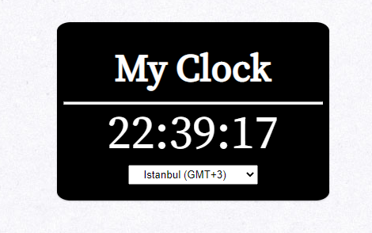 
[DEMO](https://codepen.io/mahmuttz/pen/BaoEmEG) |
[Repo](https://github.com/mahmutoz/javascript-projects/tree/main/projects/1-my-clock)

2. Custom Cursor

 
[DEMO](https://codepen.io/mahmuttz/pen/qBrrYdW) |
[Repo](https://github.com/mahmutoz/javascript-projects/tree/main/projects/2-custom-cursor)

3. Scratch Background

 
[DEMO](https://codepen.io/mahmuttz/pen/GRWvdWK) |
[Repo](https://github.com/mahmutoz/javascript-projects/tree/main/projects/3-scratch-background)

4. Coming Soon Page

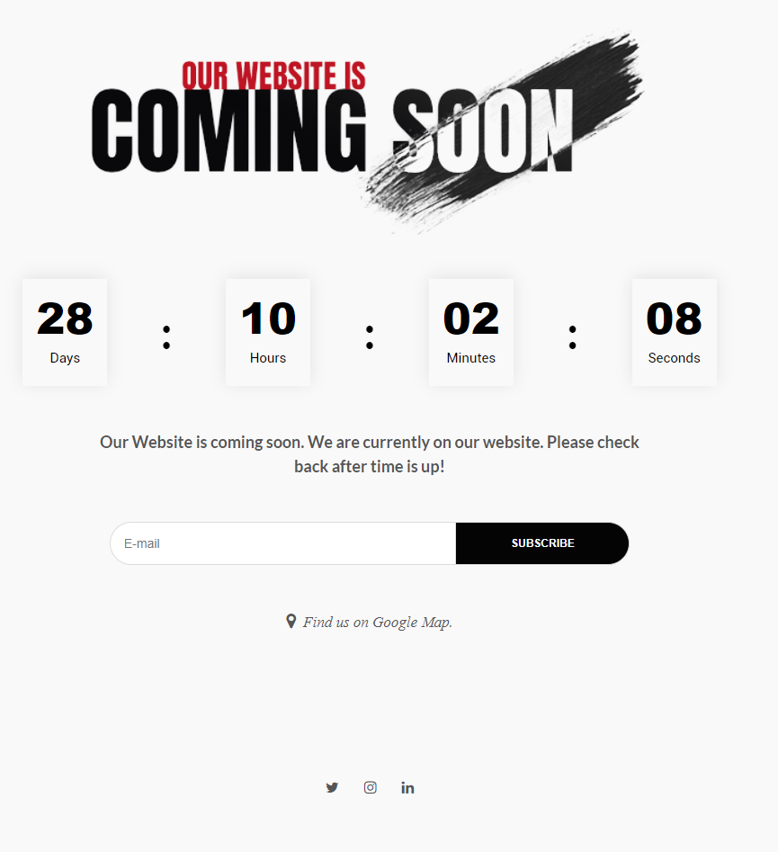 
[DEMO](https://codepen.io/mahmuttz/pen/WNpjKPR?editors=1000) |
[Repo](https://github.com/mahmutoz/javascript-projects/tree/main/projects/4-coming-soon)

5. Battery Status

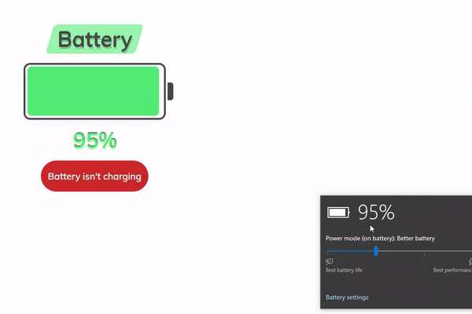 
[DEMO](https://codepen.io/mahmuttz/pen/YzZEgzW) |
[Repo](https://github.com/mahmutoz/javascript-projects/tree/main/projects/5-battery-status)

6. Product Add & Delete

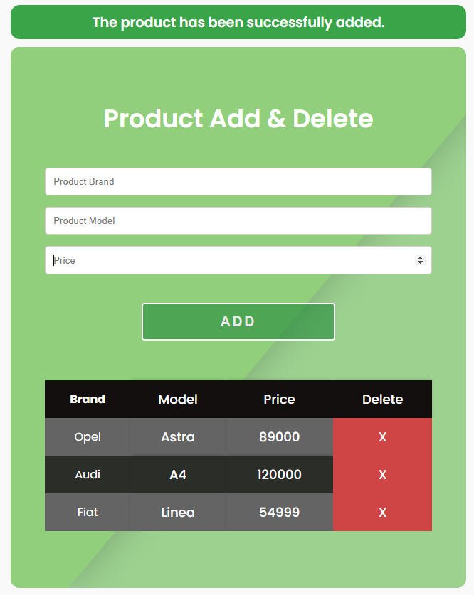 
[DEMO](https://codepen.io/mahmuttz/pen/qBrpzMb) |
[Repo](https://github.com/mahmutoz/javascript-projects/tree/main/projects/6-product-add-delete)

7. Typewriter Animation

 
[DEMO](https://codepen.io/pen/?editors=0100) |
[Repo](https://github.com/mahmutoz/javascript-projects/tree/main/projects/7-typewriter-animation)

8. Sieve of Eratosthenes

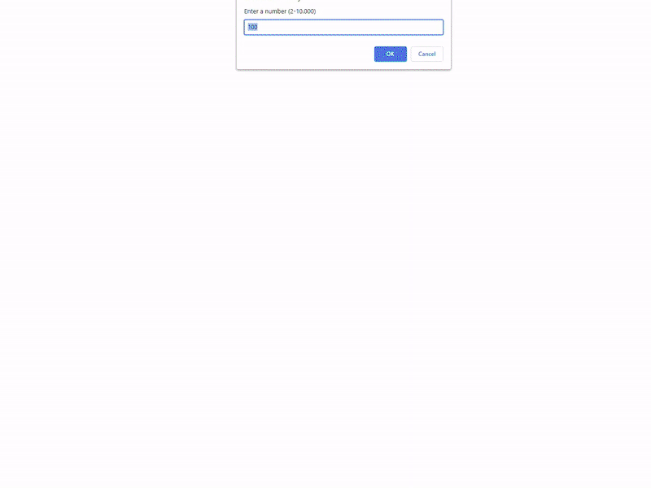 
[DEMO](https://codepen.io/mahmuttz/pen/QWprGLP) |
[Repo](https://github.com/mahmutoz/javascript-projects/tree/main/projects/8-sieve-of-eratosthenes/final/)

9. Multiple Choice Question Form

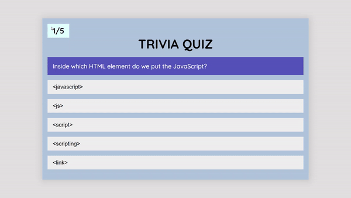 
[DEMO](https://codepen.io/mahmuttz/pen/JjWmjwO) |
[Repo](https://github.com/mahmutoz/javascript-projects/tree/main/projects/9-multiple-choice-question-form/final/)

10. Color Watch

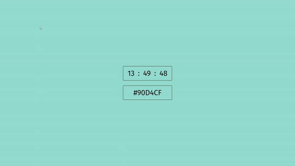 
[DEMO](https://codepen.io/mahmuttz/pen/LYWXwbe) |
[Repo](https://github.com/mahmutoz/javascript-projects/tree/main/projects/10-color-watch/final/)

11. Custom Captcha

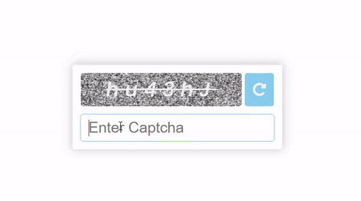 
[DEMO](https://codepen.io/mahmuttz/pen/eYWrjJx) |
[Repo](https://github.com/mahmutoz/javascript-projects/tree/main/projects/11-custom-captcha/final/)

12. Canvas Lines

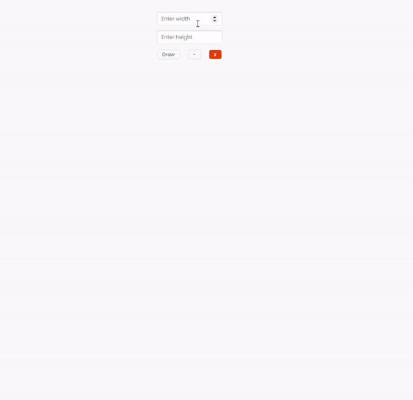 
[DEMO](https://codepen.io/mahmuttz/full/MWoowXZ) |
[Repo](https://github.com/mahmutoz/javascript-projects/tree/main/projects/12-canvas-lines/final/)

13. Slugify

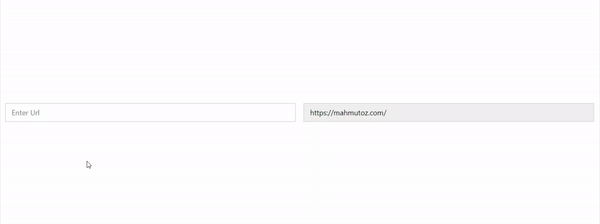 
[DEMO](https://codepen.io/mahmuttz/full/oNwQWQV) |
[Repo](https://github.com/mahmutoz/javascript-projects/tree/main/projects/13-slugify/final/)

14. Flag of Turkish

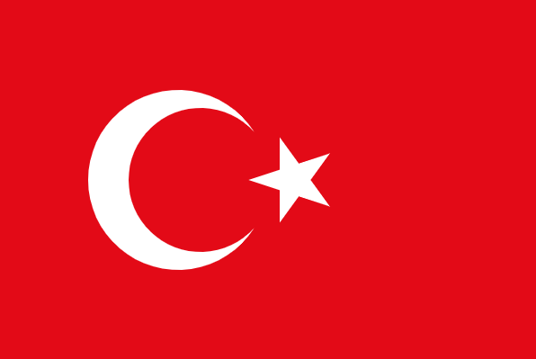 
[DEMO](https://codepen.io/mahmuttz/pen/MWvEaqb) |
[Repo](https://github.com/mahmutoz/javascript-projects/tree/main/projects/14-flag-of-turkish/final/)
